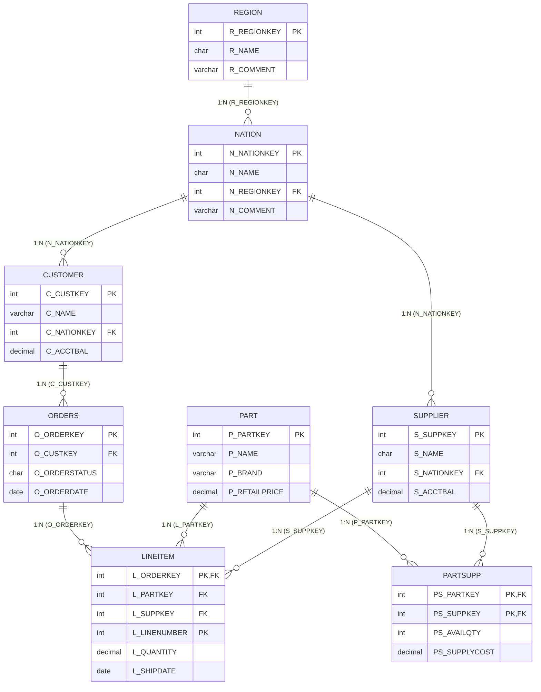
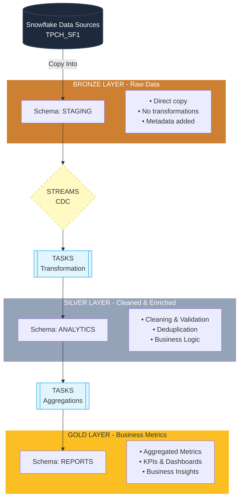
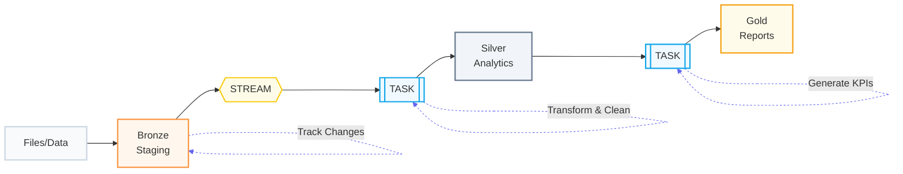

# 🎓 TPC-H Analytics Project
## Hệ Thống Phân Tích Dữ Liệu Kinh Doanh Quốc Tế

   

---

## 📋 Tổng Quan Dự Án

Đồ án cuối khóa Snowflake Bootcamp: Xây dựng một hệ thống phân tích dữ liệu kinh doanh hoàn chỉnh sử dụng **bộ dữ liệu TPC-H** - một benchmark chuẩn quốc tế cho data warehouses.

### 🎯 Mục Tiêu

Dự án này triển khai một data warehouse hiện đại với:
- **Medallion Architecture** (Bronze → Silver → Gold layers)
- **Automated Data Pipeline** (Tasks, Streams, CDC)
- **Enterprise Security** (Role-based access, Data masking)
- **Advanced Analytics** (Snowpark Python, UDFs)
- **Performance Optimization** (Query profiling, Clustering)

### 📊 Bộ Dữ Liệu

- **Source**: TPC-H Sample Data (SNOWFLAKE_SAMPLE_DATA.TPCH_SF1)
- **Scale**: 1GB (SF1)
- **Tables**: 8 bảng liên quan
- **Records**: ~8 million rows tổng cộng

**Các bảng chính:**
1. CUSTOMER (150K rows) - Thông tin khách hàng
2. ORDERS (1.5M rows) - Đơn hàng
3. LINEITEM (6M rows) - Chi tiết đơn hàng
4. PART (200K rows) - Sản phẩm
5. SUPPLIER (10K rows) - Nhà cung cấp
6. PARTSUPP (800K rows) - Quan hệ sản phẩm-nhà cung cấp
7. NATION (25 rows) - Quốc gia
8. REGION (5 rows) - Khu vực

**Mối quan hệ giữa các bảng:**

---
## 🏗️ Kiến Trúc Hệ Thống

### Medallion Architecture



### Automation Flow



---

## 🚀 Hướng Dẫn Setup

### Prerequisites

- Snowflake account với quyền ACCOUNTADMIN
- Snowflake CLI hoặc SnowSQL (optional)
- Python 3.8+ với Snowpark library (cho phần Snowpark)
- Git

### Bước 1: Clone Repository

```bash
git clone <repository-url>
cd tpch_analytics_project
```

### Bước 2: Thiết Lập Database & Roles

Chạy script sau với role ACCOUNTADMIN:

```bash
snowsql -f src/01_database_stage_roles.sql
```

Hoặc trong Snowsight UI:
1. Mở Snowsight → Worksheets
2. Copy nội dung từ `src/01_database_stage_roles.sql`
3. Chạy script

**Script này sẽ:**
- ✅ Tạo 4 roles: TPCH_ADMIN, TPCH_DEVELOPER, TPCH_ANALYST, TPCH_VIEWER
- ✅ Tạo database TPCH_ANALYTICS_DB với 4 schemas
- ✅ Tạo warehouse TPCH_WH
- ✅ Phân quyền cho các roles
- ✅ Load dữ liệu từ SNOWFLAKE_SAMPLE_DATA.TPCH_SF1

### Bước 3: Triển Khai Data Pipeline

Chạy script Medallion Architecture:

```bash
snowsql -f src/02_medallion_data_pipeline_automation.sql
```

**Script này sẽ:**
- ✅ Tạo Silver layer tables với enriched columns
- ✅ Tạo Gold layer tables cho business metrics
- ✅ Setup Streams cho CDC
- ✅ Tạo Stored Procedures cho transformations
- ✅ Tạo Tasks cho automation
- ✅ Initial load dữ liệu vào Silver & Gold layers

### Bước 4: Data Quality Checks

```bash
snowsql -f src/03_data_quality_check.sql
```

**Script này thực hiện:**
- ✅ Data profiling
- ✅ NULL value checks
- ✅ Duplicate detection
- ✅ Referential integrity validation
- ✅ Business logic validation
- ✅ Query performance analysis (EXPLAIN)

### Bước 5: Security Setup

```bash
snowsql -f src/04_masking_policies_secure_data_sharing.sql
```

**Script này triển khai:**
- ✅ 6 masking policies (EMAIL, PHONE, SSN, BALANCE, CREDIT_CARD, INCOME)
- ✅ Row access policies
- ✅ Secure views cho data sharing
- ✅ Role-based data access

### Bước 6: Snowpark Analytics (Python)

Cài đặt dependencies:

```bash
pip install snowflake-snowpark-python pandas
```

Cập nhật connection parameters trong `src/05_snowpark.py`:

```python
connection_parameters = {
    "account": "<your_account>",
    "user": "<your_username>",
    "password": "<your_password>",
    ...
}
```

Chạy script:

```bash
python src/05_snowpark.py
```

**Script này tạo:**
- ✅ RFM Customer Segmentation
- ✅ Sales trend analysis (monthly/quarterly)
- ✅ Product performance analysis
- ✅ Regional performance analysis

### Bước 7: User-Defined Functions

```bash
snowsql -f src/05_udfs.sql
```

**Script này tạo:**
- ✅ 10 SQL UDFs
- ✅ 4 Python UDFs
- ✅ 1 Table Function

---

## 📁 Cấu Trúc Dự Án

```
tpch_analytics_project/
│
├── README.md                                # Tài liệu dự án
│
├── src/
│   ├── 01_database_stage_roles.sql          # Setup database, roles, staging
│   ├── 02_medallion_data_pipeline_automation.sql  # Medallion architecture & automation
│   ├── 03_data_quality_check.sql            # Data profiling & quality checks
│   ├── 04_masking_policies_secure_data_sharing.sql  # Security & data sharing
│   ├── 05_snowpark.py                       # Snowpark Python analytics
│   └── 05_udfs.sql                          # User-defined functions
│
└── bonus/
    └── visualizations.pdf                   # Dashboard visualizations (optional)
```

---

## 🔑 Roles & Permissions

| Role | Permissions | Use Case |
|------|-------------|----------|
| **TPCH_ADMIN** | Full access to all objects | Database administration |
| **TPCH_DEVELOPER** | Create/modify objects, INSERT/UPDATE/DELETE | Data engineering, ETL development |
| **TPCH_ANALYST** | SELECT on all schemas | Business analysis, reporting |
| **TPCH_VIEWER** | SELECT on REPORTS schema only | Dashboard viewing, read-only access |

---

## 📊 Các Bảng Chính

### Bronze Layer (STAGING Schema)

| Table | Records | Description |
|-------|---------|-------------|
| REGION | 5 | Khu vực địa lý |
| NATION | 25 | Quốc gia |
| CUSTOMER | 150,000 | Khách hàng |
| SUPPLIER | 10,000 | Nhà cung cấp |
| PART | 200,000 | Sản phẩm |
| PARTSUPP | 800,000 | Quan hệ sản phẩm-nhà cung cấp |
| ORDERS | 1,500,000 | Đơn hàng |
| LINEITEM | 6,001,215 | Chi tiết đơn hàng |

### Silver Layer (ANALYTICS Schema)

| Table | Description | Key Features |
|-------|-------------|--------------|
| ORDERS_SILVER | Cleaned orders | Status descriptions, date components, priority ranks |
| CUSTOMER_SILVER | Enriched customers | Nation/region names, cleaned phone, balance categories |
| LINEITEM_SILVER | Processed line items | Calculated amounts, date components |
| PART_SILVER | Categorized products | Type categories, size categories, price ranges |
| SUPPLIER_SILVER | Enriched suppliers | Nation/region names, balance status |

### Gold Layer (REPORTS Schema)

| Table | Description | Key Metrics |
|-------|-------------|-------------|
| MONTHLY_SALES_REPORT | Monthly sales KPIs | Revenue, orders, customers, growth rates |
| CUSTOMER_METRICS | RFM analysis | Recency, Frequency, Monetary, segments |
| PRODUCT_PERFORMANCE | Product analytics | Sales, revenue, rankings |
| REGIONAL_ANALYSIS | Regional performance | Regional revenue, market share |

### Analytics Tables (from Snowpark)

| Table | Description |
|-------|-------------|
| CUSTOMER_RFM_SCORES | RFM segmentation results |
| MONTHLY_SALES_TRENDS | Monthly sales with growth metrics |
| QUARTERLY_SALES_TRENDS | Quarterly aggregations |
| PRODUCT_ANALYSIS_RESULTS | Detailed product performance |
| REGIONAL_PERFORMANCE_ANALYSIS | Regional market analysis |

---

## 🔐 Security Features

### Data Masking Policies

1. **EMAIL_MASK**: Progressive masking based on role
   - ADMIN: Full email
   - ANALYST: First 3 chars + domain
   - DEVELOPER: First 2 chars + domain
   - VIEWER: Fully masked

2. **PHONE_MASK**: Phone number protection
   - ADMIN: Full number
   - ANALYST/DEVELOPER: Last 4 digits visible
   - VIEWER: Fully masked

3. **SSN_MASK**: Social Security Number protection
   - ADMIN: Full SSN
   - ANALYST: Last 4 digits
   - Others: Fully masked

4. **BALANCE_MASK**: Financial data protection
   - ADMIN: Exact amount
   - ANALYST: Rounded to nearest 1000
   - DEVELOPER: Range category
   - VIEWER: Redacted

5. **CREDIT_CARD_MASK**: Credit card protection (PCI compliance)
6. **INCOME_MASK**: Income data protection

### Row Access Policies

- **REGIONAL_ACCESS_POLICY**: Filters data by region based on role
  - ADMIN: All regions
  - ANALYST: AMERICA & EUROPE only
  - DEVELOPER: AMERICA only
  - VIEWER: No access

### Secure Views

- **CUSTOMER_SHARE_VIEW**: Masked customer data for external sharing
- **ORDER_SUMMARY_SHARE_VIEW**: Aggregated order data
- **REGIONAL_SALES_AGGREGATE**: Regional metrics
- **PRODUCT_PERFORMANCE_SHARE_VIEW**: Product insights

---

## 🎨 User-Defined Functions

### SQL UDFs (10 functions)

1. `CLASSIFY_CUSTOMER_BY_REVENUE(revenue)` → Customer tier (VIP, GOLD, SILVER, BRONZE, STANDARD)
2. `VALIDATE_PHONE_NUMBER(phone)` → Boolean validation
3. `VALIDATE_EMAIL(email)` → Boolean validation
4. `GET_DISCOUNT_TIER(discount)` → Discount category
5. `FORMAT_CURRENCY(amount)` → Formatted currency string
6. `GET_PRIORITY_SCORE(priority, price)` → Priority score
7. `CALCULATE_SHIPPING_DELAY(ship, commit, receipt)` → Delay in days
8. `GET_SEASON(date)` → Season name
9. `CALCULATE_CLV_SCORE(recency, frequency, monetary)` → CLV score
10. `CATEGORIZE_PRODUCT_PRICE(price)` → Price category

### Python UDFs (4 functions)

1. `CALCULATE_SATISFACTION_SCORE(delivery_rate, discount, frequency)` → Satisfaction score (0-100)
2. `CLEAN_PHONE_NUMBER(phone)` → Standardized phone format
3. `CALCULATE_PROFITABILITY_INDEX(revenue, cost, quantity)` → Profitability index
4. `GENERATE_ENGAGEMENT_SCORE(days, orders, avg_value)` → Engagement JSON

### Table Functions (1 function)

1. `GET_CUSTOMER_COHORTS()` → Returns cohort analysis table

---

## 📈 Key Insights & Analytics

### Customer Segmentation (RFM Analysis)

**Segments:**
- **Champion**: High R, F, M scores (555, 554, 545, etc.)
- **Loyal**: Medium-high scores across all dimensions
- **Promising**: High recency but low frequency (new customers)
- **At Risk**: Low recency but high frequency (need re-engagement)
- **Lost**: Low scores across all dimensions

**Use Cases:**
- Targeted marketing campaigns
- Personalized offers
- Customer retention strategies
- Churn prediction

### Sales Trends

- Monthly revenue trends with MoM growth
- Seasonal patterns
- Day-of-week analysis
- Year-over-year comparisons

### Product Performance

- Top products by revenue and quantity
- Category performance
- Price range analysis
- Slow-moving inventory identification

### Regional Analysis

- Market share by region
- Regional growth rates
- Customer concentration
- Supplier distribution

---

## 🔄 Automated Data Pipeline

### Tasks Schedule

1. **TASK_TRANSFORM_ORDERS_TO_SILVER**: Runs every 5 minutes when ORDERS_STREAM has data
2. **TASK_TRANSFORM_CUSTOMER_TO_SILVER**: Runs every 5 minutes when CUSTOMER_STREAM has data
3. **TASK_TRANSFORM_LINEITEM_TO_SILVER**: Runs every 5 minutes when LINEITEM_STREAM has data
4. **TASK_GENERATE_GOLD_REPORTS**: Runs after Silver tasks complete

### Streams

- **ORDERS_STREAM**: Captures changes to ORDERS table
- **CUSTOMER_STREAM**: Captures changes to CUSTOMER table
- **LINEITEM_STREAM**: Captures changes to LINEITEM table

### Stored Procedures

1. `SP_TRANSFORM_ORDERS_TO_SILVER()`: Transform orders with enrichment
2. `SP_TRANSFORM_CUSTOMER_TO_SILVER()`: Transform customers with enrichment
3. `SP_TRANSFORM_LINEITEM_TO_SILVER()`: Transform line items with calculations
4. `SP_GENERATE_MONTHLY_SALES_REPORT()`: Generate monthly KPIs
5. `SP_GENERATE_CUSTOMER_METRICS()`: Generate RFM metrics
6. `SP_GENERATE_PRODUCT_PERFORMANCE()`: Generate product metrics
7. `SP_GENERATE_REGIONAL_ANALYSIS()`: Generate regional metrics

---

## 🎯 Business Use Cases

### 1. Customer Lifetime Value Optimization
- Identify high-value customers
- Segment customers by behavior
- Predict churn risk
- Personalize customer experience

### 2. Inventory Management
- Track product performance
- Identify slow-moving items
- Optimize stock levels
- Supplier performance analysis

### 3. Sales Forecasting
- Historical trend analysis
- Seasonal pattern detection
- Revenue prediction
- Growth rate monitoring

### 4. Regional Expansion Strategy
- Market penetration analysis
- Regional performance comparison
- Opportunity identification
- Supplier network optimization

### 5. Operational Efficiency
- Shipping delay analysis
- Order priority optimization
- Resource allocation
- Process bottleneck identification

---

## 🧪 Testing & Validation

### Data Quality Checks

✅ NULL value checks across all tables
✅ Duplicate detection in primary keys
✅ Referential integrity validation
✅ Business logic constraints
✅ Statistical outlier detection
✅ Data completeness reports

### Performance Testing

- Query execution plan analysis (EXPLAIN)
- Query profile review in Snowsight
- Clustering key recommendations
- Warehouse sizing optimization

### Security Testing

- Masking policy validation across roles
- Row access policy testing
- Secure view verification
- Data sharing compliance

---

## 📊 Sample Queries

### Top 10 Customers by Revenue

```sql
SELECT 
    C_CUSTKEY,
    C_NAME,
    C_NATION_NAME,
    SUM(O_TOTALPRICE) AS TOTAL_REVENUE,
    CLASSIFY_CUSTOMER_BY_REVENUE(SUM(O_TOTALPRICE)) AS TIER
FROM ANALYTICS.CUSTOMER_SILVER C
JOIN ANALYTICS.ORDERS_SILVER O ON C.C_CUSTKEY = O.O_CUSTKEY
GROUP BY C_CUSTKEY, C_NAME, C_NATION_NAME
ORDER BY TOTAL_REVENUE DESC
LIMIT 10;
```

### Monthly Sales Trend

```sql
SELECT 
    REPORT_DATE,
    YEAR,
    MONTH_NAME,
    TOTAL_ORDERS,
    FORMAT_CURRENCY(TOTAL_REVENUE) AS REVENUE,
    MOM_REVENUE_GROWTH
FROM REPORTS.MONTHLY_SALES_REPORT
ORDER BY REPORT_DATE DESC;
```

### Customer Segmentation Distribution

```sql
SELECT 
    RFM_SEGMENT,
    COUNT(*) AS CUSTOMER_COUNT,
    AVG(LIFETIME_VALUE) AS AVG_LTV,
    AVG(FREQUENCY) AS AVG_ORDERS
FROM REPORTS.CUSTOMER_METRICS
GROUP BY RFM_SEGMENT
ORDER BY AVG_LTV DESC;
```

---

## 🚀 Performance Optimization Tips

### 1. Clustering Keys
```sql
-- For date-range queries on ORDERS
ALTER TABLE ORDERS CLUSTER BY (O_ORDERDATE);

-- For regional queries on CUSTOMER
ALTER TABLE CUSTOMER CLUSTER BY (C_NATIONKEY);
```

### 2. Materialized Views
```sql
-- Pre-aggregate frequently accessed metrics
CREATE MATERIALIZED VIEW DAILY_SALES_MV AS
SELECT 
    O_ORDERDATE,
    COUNT(*) AS ORDER_COUNT,
    SUM(O_TOTALPRICE) AS TOTAL_REVENUE
FROM ORDERS
GROUP BY O_ORDERDATE;
```

### 3. Result Caching
- Snowflake automatically caches query results for 24 hours
- Leverage cache for repeated queries
- Use RESULT_SCAN() to access cached results

### 4. Warehouse Sizing
- Start with SMALL warehouse
- Scale up for complex queries
- Use auto-suspend (60 seconds)
- Use auto-resume for cost efficiency

---

## 🐛 Troubleshooting

### Common Issues

**Issue**: Tasks not running
```sql
-- Check task status
SHOW TASKS IN DATABASE TPCH_ANALYTICS_DB;

-- Check task history
SELECT * FROM TABLE(INFORMATION_SCHEMA.TASK_HISTORY())
WHERE NAME LIKE 'TASK_%'
ORDER BY SCHEDULED_TIME DESC;

-- Resume suspended tasks
ALTER TASK TASK_TRANSFORM_ORDERS_TO_SILVER RESUME;
```

**Issue**: Stream has no data
```sql
-- Check stream status
SHOW STREAMS;

-- Check if stream has data
SELECT SYSTEM$STREAM_HAS_DATA('ORDERS_STREAM');

-- Insert test data to trigger stream
INSERT INTO STAGING.ORDERS (...)
VALUES (...);
```

**Issue**: Insufficient permissions
```sql
-- Grant missing permissions
GRANT SELECT ON ALL TABLES IN SCHEMA STAGING TO ROLE TPCH_ANALYST;
GRANT USAGE ON WAREHOUSE TPCH_WH TO ROLE TPCH_VIEWER;
```

---

## 📚 Tài Liệu Tham Khảo

- [TPC-H Benchmark Specification](http://www.tpc.org/tpch/)
- [Snowflake Sample Data Documentation](https://docs.snowflake.com/en/user-guide/sample-data-tpch)
- [Snowpark Python Developer Guide](https://docs.snowflake.com/en/developer-guide/snowpark/python/index.html)
- [UDF Best Practices](https://docs.snowflake.com/en/developer-guide/udf/udf-overview.html)
- [Data Masking Policies](https://docs.snowflake.com/en/user-guide/security-column-ddm-intro.html)
- [Streams and Tasks](https://docs.snowflake.com/en/user-guide/tasks-intro.html)

---

## 👥 Đóng Góp

Dự án này là đồ án cuối khóa Snowflake Bootcamp. Mọi đóng góp, góp ý đều được hoan nghênh!

---

## 📄 License

This project is for educational purposes as part of Snowflake Bootcamp.

---

## 📧 Liên Hệ

- **Creator**: Phạm Quốc Nghiệp - pqnghiep1354@gmail.com
- **Date**: 12/2025
- **Dashboard Visualizations**: https://app-tpch-dashboard-4fqkuoqghsenzeurw9umyw.streamlit.app/
- **Github**: https://github.com/pqnghiep1354/snowflake-tpch-dashboard

---

## ✅ Checklist

- [x] Part 1: Database & Role Setup
- [x] Part 2: Medallion Architecture & Automation
- [x] Part 3: Data Quality Checks
- [x] Part 4: Security & Data Sharing
- [x] Part 5: Snowpark & UDFs
- [x] Documentation (README.md)
- [x] Bonus: Dashboard Visualizations

---

**🎉 Chúc bạn thành công!**
